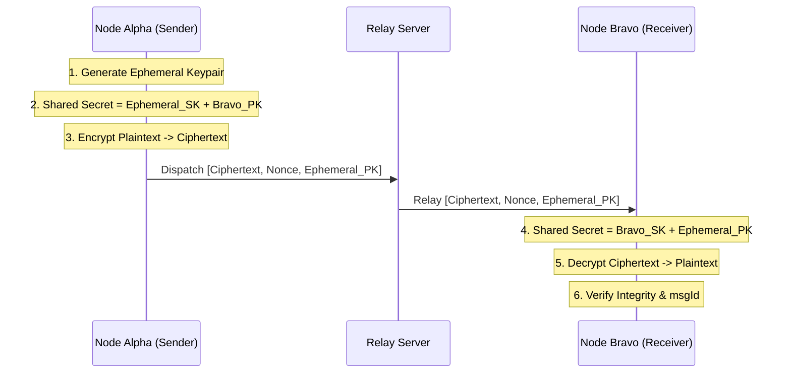

# 🛡️ CipherLink FS

[](https://github.com/Dharanish-AM/CipherLink-FS)
[](https://github.com/Dharanish-AM/CipherLink-FS)

**CipherLink FS** is a high-security, end-to-end encrypted chat prototype designed for mission-critical deployments. It provides a terminal-inspired, battle-ready interface for secure communication between nodes, enforcing advanced cryptographic protections like Forward Secrecy and Replay Protection.

---

## 🗝️ Core Security Features

| Feature | Implementation | Description |
| :--- | :--- | :--- |
| **End-to-End Encryption** | `tweetnacl` (NaCl Box) | All messages are encrypted locally; the server acts only as a blind relay. |
| **Forward Secrecy** | Ephemeral Key Rotation | Every single message packet utilizes a new, one-time-use ephemeral key pair. |
| **Replay Protection** | UUID Packet Indexing | Each packet has a unique ID; the receiver rejects any duplicate message IDs. |
| **Self-Destruct Messages** | 30s Pulse Purge | Messages are automatically purged from both sender and receiver memory after 30 seconds. |
| **MITM Simulation** | Attack Vector Demo | Built-in tool to simulate ciphertext tampering and verify integrity checks. |
| **Key Verification** | Fingerprint SHA-256 | Users can manually verify identities using cryptographic fingerprints (Public Key Hashes). |

---

## 🏗️ Technical Architecture

### Message Flow (E2EE + FS)



---

## 🛠️ Tech Stack

- **Frontend**: React 18, Vite, Lucide Icons
- **Backend**: Node.js, Express, Socket.io
- **Cryptography**: TweetNaCl (X25519, XSalsa20, Poly1305)
- **Styling**: Vanilla CSS (Terminal Aesthetic)

---

## 🚀 Quick Start

### 1. Prerequisites

- Node.js (v18+)
- npm

### 2. Server Setup

```bash
cd server
npm install
npm run dev
```

*Primary relay runs on `http://localhost:3001`*

### 3. Client Setup

```bash
cd client
npm install
npm run dev
```

*Access terminal at `http://localhost:5173`*

---

## 🎮 Simulation Modes

### 👾 MITM Attack Simulation

- Toggle **"SIMULATE MITM ATTACK"** in the chat area.
- The next message sent will have its ciphertext tampered with at the bit level.
- Observe the **Security Debug Log** as the receiver's integrity check fails and blocks decryption.

### 🕵️ Packet Inspector

- Click on any encrypted payload string in the chat to view the raw JSON packet.
- Inspect the `nonce`, `ciphertext`, and `ephemeralPublicKey` used for that specific transmission.

---

> [!CAUTION]
> This is a cryptographic prototype intended for demonstration and research. While it uses battle-tested algorithms, it is not audited for production-level field deployment.

Designed by [Dharanish-AM](https://github.com/Dharanish-AM)
